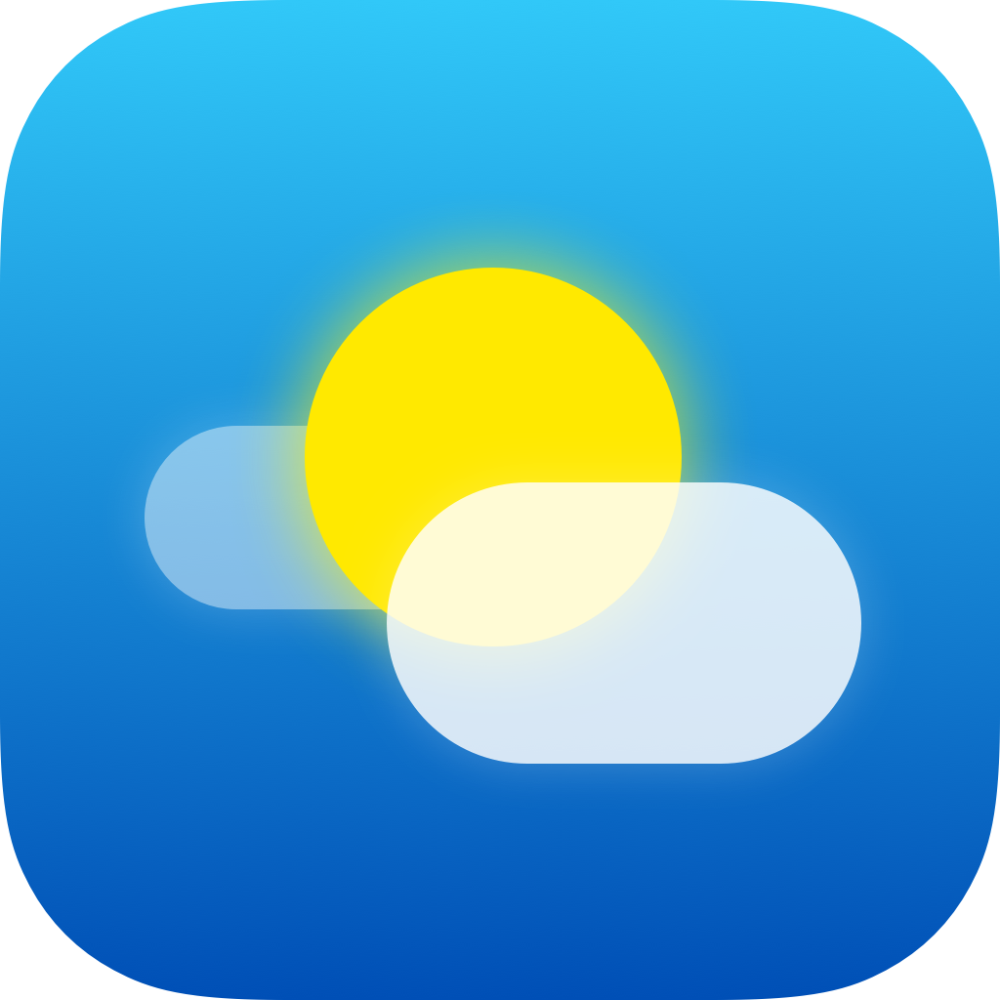
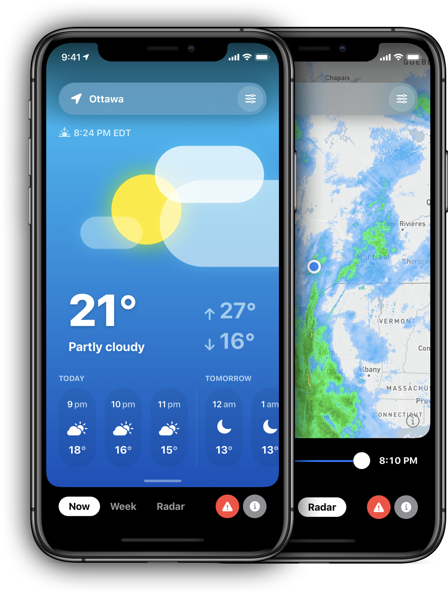

<h1 align="center">
  <a href="https://cloudsapp.romsicki.com"></a>
  <br>
  Clouds 
  <br>
</h1>

<h4 align="center">A unique weather experience for iOS, written in Swift and built using SwiftUI. Open source.</h4>

<p align="center">
  <a href="https://github.com/lfroms/clouds/issues"></a>
  
  <a href="https://github.com/lfroms/clouds/stargazers"></a>
  <a href="https://github.com/lfroms/clouds"></a>
  
</p>

<p align="center">
  <a href="#about">About</a> •
  <a href="#supported-regions">Supported Regions</a> •
  <a href="#getting-started">Getting Started</a> •
  <a href="#contributing">Contributing</a> •
  <a href="#license">License</a>
</p>

<p align="center">
  
</p>

## About

Clouds is a weather app, unlike any weather app. It's written in [SwiftUI](https://developer.apple.com/xcode/swiftui/), a declarative framework for building user interfaces for iOS. Unlike most weather apps, Clouds uses a custom GraphQL-powered weather data aggregation service, [Nimbus](https://github.com/lfroms/nimbus).

### Vision & Goals

* **Simple.** It should have a no-nonsense user interface that is easy for anyone to understand.
* **Beautiful.** Not only should the user interface be easy to understand, it should also be pleasant to look at.
* **Trustworthy.** Weather data should be accurate, and from trusted sources.
* **Unique.** Clouds should be as different from other weather apps as possible. It should provide a 'breath of fresh air' for users.
* **Fast.** It should boot instantly and weather data should appear as quickly as possible. The user should not need to worry about the data loading process.
* **Smooth.** There should be virtually zero user interface bugs. Bugs are frustrating to the user.

## Status

As of October 31, 2022, Clouds is sunset and is no longer available for download. However, the source code remains available and contributions are still welcome. For local development, you will need an instance of [Nimbus](https://github.com/lfroms/nimbus) running.

## Supported Regions

Clouds' region compatibility largely depends on the regions in which Nimbus is supported. Currently, the following regions are supported:

* Canada _via_ [Environment Canada](https://weather.gc.ca)

### Radar

Radar regions are independent from weather regions. Currently, the following data sources are supported:

* [MSC GeoMet](https://eccc-msc.github.io/open-data/) (Environment and Climate Change Canada)
* [RainViewer](https://www.rainviewer.com), which provides global radar imagery.

## Getting Started

To get started, you'll need to pull the source code. Find yourself a working directory, and clone this repo to it. I recommend using [GitHub Desktop](https://desktop.github.com).

Otherwise, pull it using the `git` CLI:
```sh
git clone https://github.com/lfroms/clouds.git
```

Then, navigate into the cloned repository:
```sh
cd clouds
```

If it's your first time contributing, you'll need to register for a Mapbox account and [create a new access token](https://docs.mapbox.com/ios/maps/overview/#configure-credentials) and add it to your `~/.netrc` file. The article linked describes how to create such a file and how to format it. Setting up this credential is _required_ to be able to download the Mapbox SDK Swift Package Manager package. This secret is automatically configured in GitHub Actions runs.

You can then open the Xcode project (named `Clouds.xcodeproj`) in Xcode.

## Contributing

### Code
If you have any improvements that you'd like to make to Clouds, please create a branch and open a pull request! This project is meant to be community-driven. It cannot evolve without your help! Please be mindful of the software architecture. It can't be maintained if you're the only person that is able to understand what it does.  When in doubt, try to mimic the existing architecture. If you think that the architecture can be improved, please [open an issue](https://github.com/lfroms/clouds/issues/new/choose). Current architecture and decisions are documented in the [Wiki](https://github.com/lfroms/clouds/wiki).

Oh, and please write tests. There aren't any tests right now, but I simply don't have the capacity to write them. All new contributions _should_ be tested.

Code should be linted using [SwiftLint](https://github.com/realm/SwiftLint). Please ensure that you've executed SwiftLint (or SwiftFormat for Xcode, at least) with the default ruleset before pushing your changes. Eventually, this will be configured to run in a GitHub Action.

### Design
Are you a designer? Do you think parts of the app's design can be improved? Please [open an issue](https://github.com/lfroms/clouds/issues/new/choose) with your design ideas! Clouds should be the best-looking weather app around. Try to keep the design language consistent. Your design should seamlessly fit in with the rest of the app.

### Documentation
Clouds needs better documentation! The [Wiki](https://github.com/lfroms/clouds/wiki) sure could use some help. Think the README needs some more information? Add it!

### Localization
Right now, Clouds is only available in English (Canada). While this accounts for most users in the currently supported regions, it simply isn't enough to reach a global audience.

## Releases

Clouds is released to the Apple App Store on a regular basis, provided that there are enough changes to justify a new release. Pressing bug fixes will be released promptly. GitHub releases correspond to App Store releases. Release notes will be collected in _draft_ GitHub releases prior to submission. GitHub releases represent the cutoff for all code in a release, and any code pushed to `master` afterwards will be considered for the _next_ release.

[Fastlane](https://fastlane.tools) is used to take automated screenshots for the App Store listing. Everything in the `fastlane` directory can be ignored, as there is a specific process for taking these screenshots that has not yet been documented.

## License

Clouds is released under the [MIT License](LICENSE.md).
